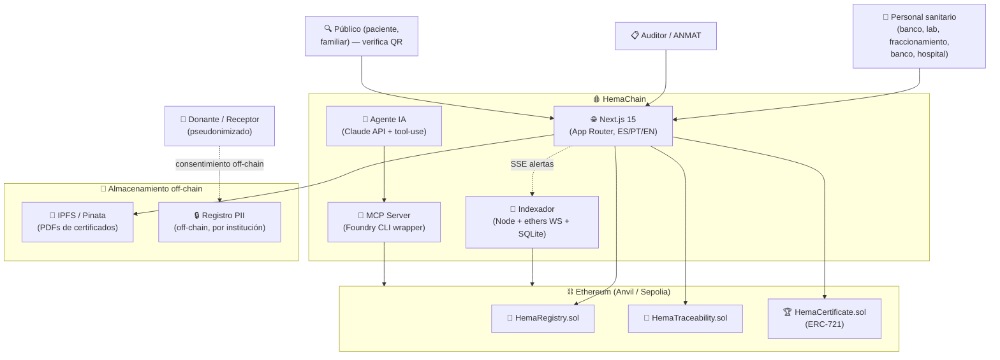
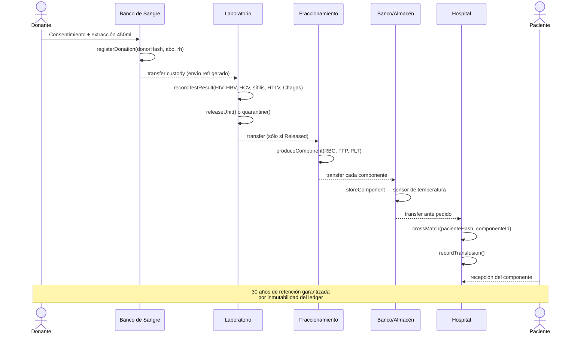

# HemaChain · Trazabilidad de Donaciones de Sangre en Blockchain

> **Trabajo Final de Máster — Máster en Blockchain (CodeCrypto Academy, 2026)**
> TFM 3 — *Trazabilidad Industrial y Certificaciones con Blockchain*
> Adaptación del enunciado industrial al sector hemoterápico argentino, alineada con la **Resolución 536/2026 del Ministerio de Salud** que exige trazabilidad informatizada en todos los centros de hemoterapia, bancos de sangre y servicios de medicina transfusional del país.

📄 **Documentación técnica completa →** [`docs/SDD.md`](./docs/SDD.md)
✅ **Seguimiento de fases →** [`docs/TRACK.md`](./docs/TRACK.md)
🧠 **Retrospectiva de uso de IA →** [`IA.md`](./IA.md)

---

## 1. Descripción del proyecto

**HemaChain** es una aplicación descentralizada (dApp) que registra de forma inmutable el ciclo completo de vida de una donación de sangre: desde la extracción en un banco de sangre, pasando por el tamizaje serológico, el fraccionamiento en componentes (glóbulos rojos, plasma, plaquetas, crioprecipitado), el almacenamiento y la cadena de frío, hasta la transfusión al paciente. Cada evento queda asentado en un *smart contract* sobre Ethereum, con certificaciones digitales emitidas como NFTs ERC-721 cuyos PDFs originales se anclan en IPFS con verificación criptográfica.

El sistema está diseñado como **implementación de referencia** del marco regulatorio argentino vigente y proyectado:
- **Ley 22.990** (Ley Nacional de Sangre, 1983) y su Decreto Reglamentario 1338/04
- **Resolución 865/2006** del Ministerio de Salud — *Normas Técnicas y Administrativas de la Especialidad Hemoterapia*
- **Resolución 536/2026** del Ministerio de Salud — modernización del Sistema Nacional de Sangre, abril 2026

A escala internacional, HemaChain implementa el estándar global **ISBT 128** (ICCBBA) para identificación de productos sanguíneos, lo que garantiza interoperabilidad transfronteriza con sistemas de MERCOSUR, la Unión Europea (Directiva 2002/98/EC) y otros marcos regulatorios.

---

## 2. Problema que resuelve

El sistema nacional de sangre argentino — y por extensión cualquier sistema hemoterápico — enfrenta problemas estructurales que el blockchain resuelve naturalmente:

| Problema | Solución HemaChain |
|---|---|
| Registros fragmentados entre instituciones (cada banco / hospital tiene su propio sistema) | Libro mayor compartido — todas las instituciones leen y escriben al mismo contrato, sin contratos bilaterales |
| Look-back manual y lento ante un donante que da positivo posteriormente | Función on-chain `reportAdverseEvent(donorHash)` que marca atómicamente como *Recalled* todos los componentes derivados |
| Cadena de frío no verificable post-hoc | Cada `CustodyEvent` registra temperatura; desvíos disparan recall automático |
| Certificados de acreditación (AAHITC, ISO 15189, ANMAT) en PDF, falsificables | NFTs ERC-721 con `documentHash = keccak256(PDF)` y CID en IPFS |
| Imposibilidad para el paciente o auditor de verificar el origen de una unidad sin acceso privilegiado | Página pública `/verify/[id]` accesible sin wallet, con datos anonimizados |
| Datos personales del donante y receptor en sistemas centralizados con riesgo de filtración | Sólo hashes on-chain (`keccak256(DNI + salt institucional)`); PII off-chain bajo control de cada institución (compatible con Ley 25.326) |
| Trazabilidad regulatoria con retención de 30 años imposible de garantizar técnicamente | Inmutabilidad nativa del ledger satisface el requisito de archivo a largo plazo |

**El argumento clave para el video y el README**: la Res. 536/2026 *exige* trazabilidad informatizada a todos los centros del país, con un plazo de 2 años para implementar los cambios tecnológicos. HemaChain es un prototipo de referencia de esa infraestructura, listo para escalar a producción.

---

## 3. Tecnologías utilizadas

### Blockchain & Smart Contracts
- **Solidity** 0.8.24+
- **Foundry** (Forge, Anvil, Cast) — framework de desarrollo, testing y deployment
- **OpenZeppelin Contracts v5** — `AccessControl`, `Pausable`, `ReentrancyGuard`, `ERC721URIStorage`
- **Sepolia** (testnet público) para verificación en Etherscan
- **Anvil** (blockchain local) para desarrollo iterativo

### Frontend
- **Next.js 15** (App Router) + **React 19** + **TypeScript**
- **Tailwind CSS v4** + componentes inspirados en shadcn/ui
- **ethers.js v6** — librería Web3
- **MetaMask** — wallet de referencia
- **lucide-react** — iconografía
- **next-intl** — internacionalización (es / pt / en)
- **sonner** — sistema de notificaciones
- **recharts** + **Leaflet** — visualizaciones (cadena de frío, mapa de instituciones)

### Off-chain & innovación
- **IPFS** vía **Pinata** — almacenamiento de PDFs de certificados
- **Node.js + ethers WS + SQLite** — indexador de eventos con SSE para alertas en vivo
- **MCP Server** (Model Context Protocol) — envoltorio de Foundry CLI (anvil/cast/forge) para control via lenguaje natural
- **Claude API** + tool-use — agente "Ask HemaChain" embebido en el dashboard

### Herramientas de IA
- **Claude Code (Opus 4.7)** — agente principal de desarrollo
- **ChatGPT** — investigación regulatoria complementaria
- Documentación detallada en [`IA.md`](./IA.md)

---

## 4. Arquitectura del sistema

### Diagrama C4 — Contenedores



### Flujo de extremo a extremo



> **Más diagramas** (modelo de dominio, máquina de estados, matriz de permisos, flujo de look-back) en [`docs/SDD.md`](./docs/SDD.md) §6–§7.

---

## 5. Instalación y configuración

### Prerrequisitos
- **Node.js** ≥ 20
- **Foundry** — `curl -L https://foundry.paradigm.xyz | bash && foundryup`
- **MetaMask** en el navegador
- **Cuenta en Pinata** (gratuita) — necesaria para IPFS

### Clonar e instalar

```bash
# Clonar desde GitHub (espejo público)
git clone git@github.com:agamezg/hemachain.git
cd hemachain

# (o bien) desde GitLab de la academia
# git clone ssh://git@gitlab.codecrypto.academy:2222/ariel.ep91/eth-pfm-chain-tracker.git

# Smart contracts
cd sc
forge install
forge build
forge test

# Frontend
cd ../web
npm install
cp .env.example .env.local   # editar con direcciones y claves
```

### Desarrollo local — orquestación de 3 terminales

```bash
# Terminal 1 — blockchain local
anvil

# Terminal 2 — desplegar contratos + cargar datos demo
cd sc
forge script script/Deploy.s.sol --rpc-url http://localhost:8545 --broadcast
forge script script/Seed.s.sol --rpc-url http://localhost:8545 --broadcast

# Terminal 3 — frontend
cd web
npm run dev
# → http://localhost:3000
```

### Configurar MetaMask para Anvil

| Campo | Valor |
|---|---|
| Network Name | `Anvil Local` |
| RPC URL | `http://localhost:8545` |
| Chain ID | `31337` |
| Currency Symbol | `ETH` |

Cuentas de Anvil sugeridas por rol (las primeras seis):

| Rol | Address |
|---|---|
| ADMIN | `0xf39Fd35Df6D7...266` |
| BANCO_SANGRE | `0x70997970...79C8` |
| LABORATORIO | `0x3C44CdDd...93BC` |
| FRACCIONAMIENTO | `0x90F79bf6...b906` |
| MEDICINA_TRANSFUSIONAL | `0x15d34AAf...6A65` |
| AUDITOR | `0x9965507D...0a4dc` |
| CERTIFICADOR | `0x976EA740...0aa9` |

---

## 6. Smart contracts desplegados

> ✅ **Desplegado y verificado en Sepolia** (chain id `11155111`, mayo 2026). Las direcciones de Anvil son deterministas (cuenta 0, nonces 0/1/2 de `Deploy.s.sol`).

| Contrato | Anvil (local) | Sepolia (verificado en Etherscan) |
|---|---|---|
| `HemaRegistry.sol` | `0x5FbDB2315678afecb367f032d93F642f64180aa3` | [`0xFfFeD3c8d864D1A5c39F7BA1292a2162ED616ecF`](https://sepolia.etherscan.io/address/0xFfFeD3c8d864D1A5c39F7BA1292a2162ED616ecF#code) |
| `HemaTraceability.sol` | `0xe7f1725E7734CE288F8367e1Bb143E90bb3F0512` | [`0x7b92DcD02c6F04b5FA3937d7769586D44F5D2953`](https://sepolia.etherscan.io/address/0x7b92DcD02c6F04b5FA3937d7769586D44F5D2953#code) |
| `HemaCertificate.sol` (ERC-721) | `0x9fE46736679d2D9a65F0992F2272dE9f3c7fa6e0` | [`0xADc6C4731c318a1CD5C5fAccFE8EAE6CdaEE791E`](https://sepolia.etherscan.io/address/0xADc6C4731c318a1CD5C5fAccFE8EAE6CdaEE791E#code) |

Los tres contratos tienen su **código fuente verificado** en Etherscan (Solidity 0.8.24, EVM cancun, optimizer runs=200). El admin del registro es la wallet de deploy `0xa49aA91a06a58c9D29Ac1314626aD51314004947`.

---

## 7. Casos de uso principales

1. **Registro de donación** — el Banco de Sangre asienta la extracción con hash anonimizado del donante, ABO/Rh codificado en ISBT 128 y volumen.
2. **Tamizaje** — el Laboratorio carga el resultado serológico + NAT (incluido **Chagas**, obligatorio en Argentina) y libera la unidad o la cuarentena.
3. **Fraccionamiento** — el Centro de Fraccionamiento divide la sangre entera en hasta tres componentes (GR, PFC, CP), cada uno como entidad on-chain con padre trazable.
4. **Almacenamiento con cadena de frío** — el Banco registra eventos de custodia con temperatura; un desvío fuera de rango dispara el cambio de estado a `Recalled`.
5. **Transfusión** — el Hospital ejecuta la prueba cruzada (con hash del paciente) y registra la transfusión final.
6. **Look-back automatizado** — un Auditor reporta un evento adverso (donante positivo posterior); el contrato marca atómicamente como *Recalled* todos los componentes derivados de cualquier donación de ese donante.
7. **Verificación pública** — un paciente o familiar escanea el QR impreso en la unidad y accede a `/verify/[id]`, viendo la trayectoria anonimizada sin necesidad de wallet.
8. **Emisión y revocación de certificaciones** — un Certificador (AAHITC, ANMAT) emite un NFT con el PDF anclado en IPFS; puede revocarlo si la acreditación expira o se compromete.

---

## 8. Capturas de pantalla

> ⏳ **Pendiente Phase 6/8.** Carpeta [`screenshots/`](./screenshots/) — mínimo 7 capturas según el plan:

| # | Archivo | Contenido |
|---|---|---|
| 1 | `01-landing.png` | Landing en español con estadísticas en vivo |
| 2 | `02-dashboard-bank.png` | Dashboard del Banco de Sangre con inventario y alertas |
| 3 | `03-traceability-timeline.png` | Timeline de trazabilidad de una unidad |
| 4 | `04-certificate-nft.png` | Detalle de un certificado NFT con QR de verificación |
| 5 | `05-public-verify.png` | Página pública `/verify/[id]` desde móvil |
| 6 | `06-cold-chain-alert.png` | Alerta de desvío de cadena de frío en tiempo real |
| 7 | `07-etherscan-tx.png` | Transacción verificada en Sepolia / Etherscan |

---

## 9. Diagramas técnicos

Diagramas completos en formato Mermaid (versionables en Git, renderizados automáticamente por GitHub) en:
- [`docs/SDD.md`](./docs/SDD.md) — todos los diagramas embebidos
- `docs/diagramas.md` — fuente reutilizable

Tipos incluidos: C4 (Contexto, Contenedor, Componente), Secuencias (flujo feliz, look-back), Máquina de estados (`Unit` y `Component`), Modelo de dominio (clases), Matriz de permisos (rol × función).

---

## 10. Video demo

> ⏳ **Pendiente Phase 8.** Loom, ≤ 5 minutos, en español.

Guion previsto:
- **0:00–0:30** — introducción: problema, Res. 536/2026 como ancla regulatoria
- **0:30–1:30** — tecnología y arquitectura (Foundry + Next.js + IPFS + MCP + AI)
- **1:30–4:00** — demo en vivo: registro → tamizaje → fraccionamiento → almacenamiento → transfusión → verificación pública
- **4:00–5:00** — innovaciones vs esqueleto, visión de adopción estatal, conclusiones

Enlace público: *(pendiente)*

---

## 11. Innovaciones implementadas (vs. esqueleto)

El esqueleto del TFM propone una cadena `Producer → Factory → Retailer → Consumer` con tokens fungibles. HemaChain va sustancialmente más allá:

| Innovación | Impacto | Capa |
|---|---|---|
| **Vertical no presente en los 5 ejemplos** (sangre vs. textiles/madera/etc.) | Diferenciación inmediata, contexto regulatorio argentino real | Conceptual |
| **5 roles especializados** alineados con la Res. 865/2006 (Banco, Lab, Fraccionamiento, Banco, Hospital + Auditor + Certificador + Admin) | Modelo de dominio realista, no genérico | Smart contract |
| **Tamizaje obligatorio argentino con Chagas** | Especificidad regional, no replicable copiando esqueleto genérico | Smart contract |
| **Componentes derivados** (sangre entera → GR + PFC + CP + Crio) con propagación de recall | Modelo de transformación industrial real, no trivial | Smart contract |
| **Look-back automatizado on-chain** | Función única que cumple Art. 14 EU 2002/98/EC y Res. 865/2006 | Smart contract |
| **Cadena de frío con cambio de estado automático** | Sensores + on-chain enforcement, no sólo registro | Smart contract |
| **Certificaciones como NFTs ERC-721** con IPFS + verificación de hash | Aplicación real de NFTs no-financieros | Smart contract + frontend |
| **Página pública de verificación** (`/verify/[id]`) sin wallet | Acceso para paciente / familiar / regulador | Frontend |
| **QR impreso en la unidad** apuntando a la verificación pública | Puente físico-digital | Frontend |
| **Indexador de eventos con SSE** para alertas en tiempo real | UX superior vs. polling | Off-chain |
| **MCP Server envolviendo Foundry CLI** | Control vía lenguaje natural; bonus +5 % del rúbrica | Tooling/IA |
| **Agente "Ask HemaChain"** con Claude tool-use | Consultas de trazabilidad en lenguaje natural | Frontend/IA |
| **Multilenguaje** (es / pt / en) con `next-intl` | Apertura MERCOSUR + audiencia internacional | Frontend |
| **Privacidad por diseño** — sólo hashes on-chain, PII off-chain (Ley 25.326) | Cumplimiento regulatorio de datos personales | Arquitectural |
| **Datos demo realistas** — 30+ donantes, look-back, excursión térmica, revocación | Demo memorable y reproducible | Tooling |

Detalle técnico completo en [`docs/SDD.md`](./docs/SDD.md) §8 y §10.

---

## 12. Uso de Inteligencia Artificial

Retrospectiva detallada (herramientas usadas, horas por fase, errores comunes, valor agregado, MCP) en [`IA.md`](./IA.md).

---

## 13. Autor

**Ariel** ([ariel.ep91@gmail.com](mailto:ariel.ep91@gmail.com))
Máster en Blockchain — *CodeCrypto Academy* — cohorte 2026.
🇦🇷 Buenos Aires, Argentina.

Repositorios del proyecto:
- 📦 **GitHub (público):** [`github.com/agamezg/hemachain`](https://github.com/agamezg/hemachain)
- 📚 **GitLab (entrega académica):** `gitlab.codecrypto.academy:ariel.ep91/eth-pfm-chain-tracker`

---

## 14. Licencia

[MIT](./LICENSE) — uso libre con atribución. La intención explícita del autor es que este código sirva como **semilla de referencia** para una futura adopción por parte del Ministerio de Salud argentino o servicios provinciales de hemoterapia, en el marco de la implementación de la Res. 536/2026.

---

## Documentos de referencia del esqueleto

El presente repositorio mantiene los documentos originales provistos por la academia como contexto del enunciado:

- [📄 Instrucciones Generales de Entrega - TFM](./Instrucciones%20Generales%20de%20Entrega%20-%20TFM%202c00249c79f781e69c36da256cd077f0.md)
- [📄 TFM 1: Trazabilidad Alimentaria](./TFM%201%20Trazabilidad%20Alimentaria%20con%20Blockchain%202bf0249c79f78094a6d4cbe2186367d6.md)
- [📄 TFM 2: Trazabilidad Logística](./TFM%202%20Trazabilidad%20Log%C3%ADstica%20con%20Blockchain%202bf0249c79f7809595f1f31914e423f6.md)
- [📄 **TFM 3: Trazabilidad Industrial y Certificaciones** *(opción elegida)*](./TFM%203%20Trazabilidad%20Industrial%20y%20Certificaciones%20co%202bf0249c79f78014b080da0447e5f009.md)
- [📄 TFM 4: Certificación Académica Digital](./TFM%204%20Certificaci%C3%B3n%20Acad%C3%A9mica%20Digital%20con%20Blockcha%202bf0249c79f78086969fc4a76e23288b.md)
- [📄 TFM 5: Energía Renovable y Certificados Verdes](./TFM%205%20Energ%C3%ADa%20Renovable%20y%20Certificados%20Verdes%20con%20%202bf0249c79f78037b0b7d9102ec81108.md)
