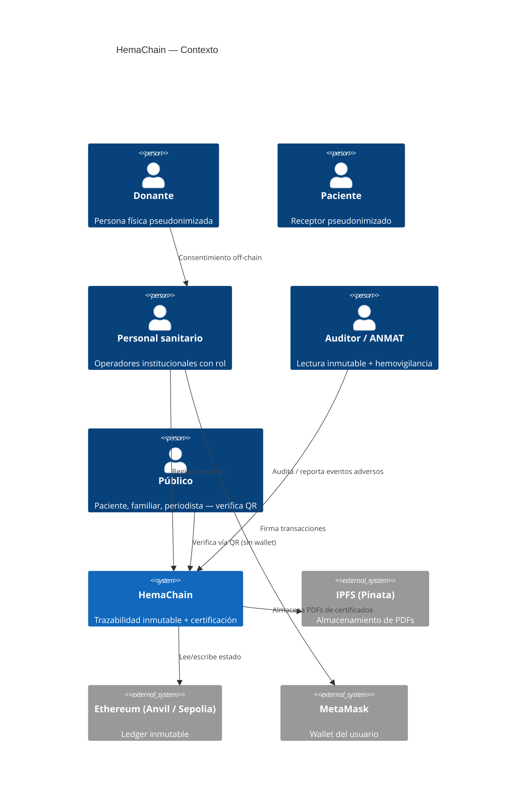
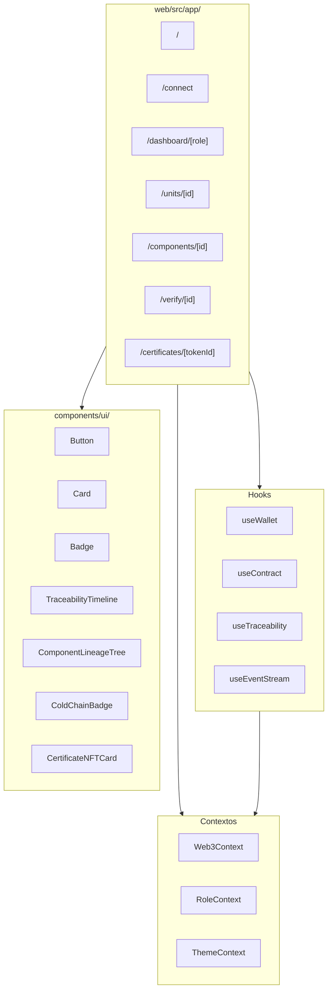
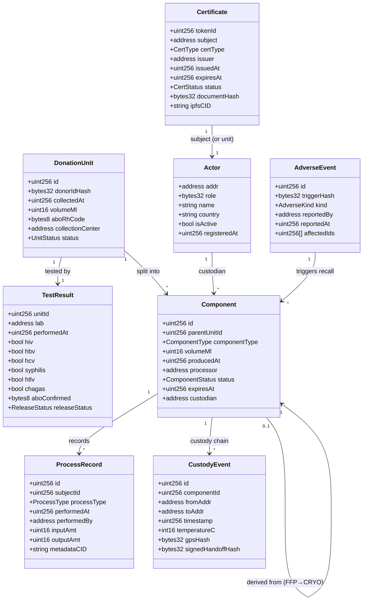
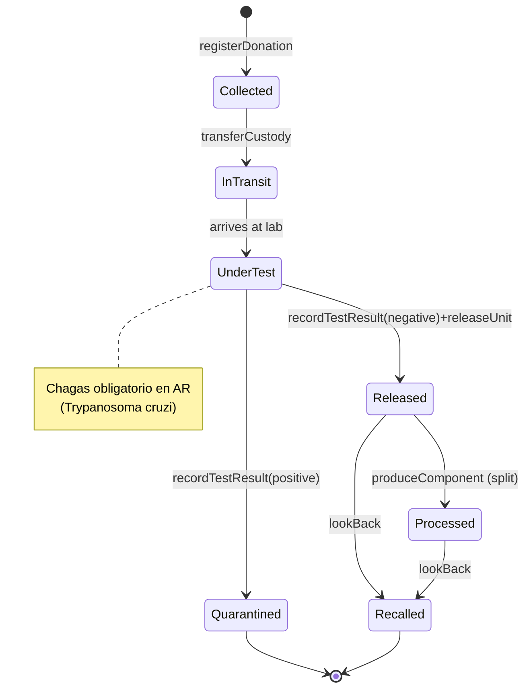
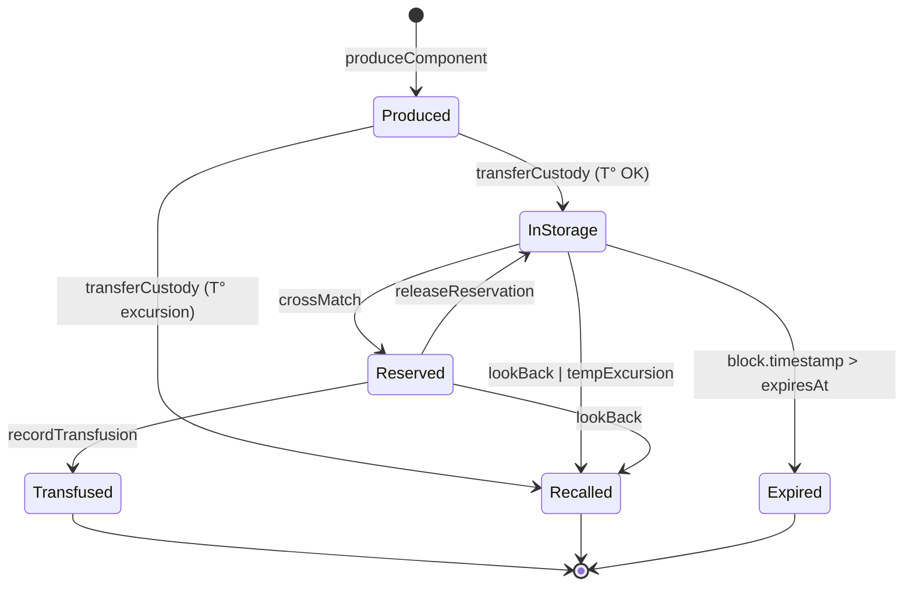

# Software Design Document — HemaChain

> **Proyecto:** HemaChain — Trazabilidad de donaciones de sangre y certificaciones sobre Ethereum
> **TFM 3:** Trazabilidad Industrial y Certificaciones con Blockchain
> **Autor:** Ariel — Máster en Blockchain, CodeCrypto Academy (2026)
> **Versión:** 0.1 (WIP — se completa en cada Phase del [`TRACK.md`](./TRACK.md))
> **Última actualización:** Phase 0

---

## Tabla de contenidos

1. [Resumen ejecutivo](#1-resumen-ejecutivo)
2. [Planteo del problema y contexto regulatorio](#2-planteo-del-problema-y-contexto-regulatorio)
3. [Partes interesadas y roles](#3-partes-interesadas-y-roles)
4. [Requisitos funcionales](#4-requisitos-funcionales)
5. [Requisitos no funcionales](#5-requisitos-no-funcionales)
6. [Arquitectura del sistema (C4)](#6-arquitectura-del-sistema-c4)
7. [Modelo de dominio](#7-modelo-de-dominio)
8. [Diseño de los smart contracts](#8-diseño-de-los-smart-contracts)
9. [Arquitectura del frontend](#9-arquitectura-del-frontend)
10. [Componentes off-chain](#10-componentes-off-chain)
11. [Modelo de seguridad](#11-modelo-de-seguridad)
12. [Estrategia de testing](#12-estrategia-de-testing)
13. [Topología de deployment](#13-topología-de-deployment)
14. [Riesgos y mitigaciones](#14-riesgos-y-mitigaciones)
15. [Glosario y referencias](#15-glosario-y-referencias)

---

## 1. Resumen ejecutivo

**HemaChain** es una aplicación descentralizada que registra de manera inmutable, auditable e interoperable el ciclo de vida completo de una donación de sangre humana — desde la extracción al donante hasta la transfusión al paciente, pasando por tamizaje serológico, fraccionamiento en componentes y custodia con cadena de frío. Cada institución (Banco de Sangre, Laboratorio, Centro de Fraccionamiento, Banco/Almacén, Hospital, Auditor regulatorio) interactúa con un contrato compartido sobre Ethereum, con permisos basados en rol y emisión de certificaciones digitales como NFTs ERC-721 cuyos PDFs originales se anclan en IPFS.

El proyecto se enmarca en la **Resolución 536/2026 del Ministerio de Salud argentino** (abril 2026), que moderniza el Sistema Nacional de Sangre y obliga a todos los centros de hemoterapia a implementar trazabilidad informatizada en un plazo de dos años. HemaChain constituye una implementación de referencia de esa exigencia, técnicamente compatible con el estándar global **ISBT 128** y conceptualmente alineada con la Directiva europea 2002/98/EC y las guías de la WHO.

El alcance abarca: 3 smart contracts (`HemaRegistry`, `HemaTraceability`, `HemaCertificate`), un frontend Next.js multilenguaje (español, portugués, inglés), un indexador de eventos con notificaciones en vivo (SSE), un MCP Server que envuelve la CLI de Foundry, un agente IA embebido para consultas de trazabilidad en lenguaje natural, una página pública de verificación accesible sin wallet, y un sistema de demo seedable con escenarios de look-back, excursión térmica y revocación de certificados.

---

## 2. Planteo del problema y contexto regulatorio

### 2.1. El problema

El sistema hemoterápico argentino opera sobre una red de cientos de bancos de sangre, laboratorios, centros de fraccionamiento y servicios hospitalarios de medicina transfusional, distribuidos en jurisdicciones provinciales y privadas. Cada institución mantiene sus propios registros (frecuentemente en planillas o sistemas legacy aislados), lo que produce:

1. **Fragmentación informativa** — el seguimiento de una unidad de sangre desde el donante hasta el receptor requiere coordinación manual entre múltiples sistemas que no se comunican.
2. **Look-back lento y manual** — cuando un donante posteriormente da positivo (HIV, HCV, Chagas, etc.), localizar todos los componentes derivados de sus donaciones implica búsquedas individuales en cada institución que recibió custodia.
3. **Cadena de frío opaca** — los registros de temperatura durante el transporte y almacenamiento existen en bitácoras analógicas o en sistemas SCADA aislados; no es posible auditar post-hoc su integridad.
4. **Certificaciones falsificables** — los certificados de acreditación (AAHITC, ISO 15189, ANMAT, sustentabilidad) circulan en PDF, sin un mecanismo nativo de verificación criptográfica.
5. **Falta de verificación pública** — el paciente o su familia no tiene un canal técnico para verificar la procedencia y el procesamiento de la unidad que se le transfunde.
6. **Cumplimiento regulatorio costoso** — la retención obligatoria de registros por décadas impone costos de infraestructura difíciles de garantizar en el largo plazo.

### 2.2. Marco regulatorio — PRIMARIO (Argentina)

| Norma | Año | Contenido relevante |
|---|---|---|
| **Ley 22.990** *Ley Nacional de Sangre* | 1983 | Define la donación como acto voluntario, altruista y no remunerado; establece el Banco de Sangre, el Servicio de Hemoterapia y la red nacional |
| **Decreto Reglamentario 1338/04** | 2004 | Reglamentación operativa de la Ley 22.990 |
| **Resolución 865/2006 MS** | 2006 | *Normas Técnicas y Administrativas de la Especialidad Hemoterapia* — manual operativo de los servicios de hemoterapia |
| **🆕 Resolución 536/2026 MS** | abril 2026 | Modernización del Sistema Nacional de Sangre — **obliga a informatizar registros y garantizar trazabilidad en todos los centros**, con 2 años de plazo. *Ancla regulatoria primaria del proyecto.* |
| **Ley 25.326** *Protección de Datos Personales* | 2000 | Marco de privacidad — fundamento del diseño "sólo hashes on-chain, PII off-chain" |

### 2.3. Marco regulatorio — SECUNDARIO (internacional)

| Norma | Origen | Uso en HemaChain |
|---|---|---|
| **ISBT 128** | ICCBBA (global) | Estándar de identificación de productos sanguíneos — adoptado en el modelo de datos |
| **Directiva 2002/98/EC** Art. 14 | UE | Benchmark para retención de 30 años; satisfecha naturalmente por inmutabilidad del ledger |
| **Directiva 2005/61/EC** | UE | Modelo de hemovigilancia y reporte de eventos adversos |
| **AABB Standards** | EE.UU. | Referencia para estructura de tamizaje |
| **WHO Blood Safety** | Global | Línea base universal |
| **MERCOSUR GMC** | Regional | Apertura cross-border futura (motivación para soporte portugués) |

### 2.4. Acreditadores argentinos relevantes

- **AAHITC** — Asociación Argentina de Hemoterapia, Inmunohematología y Terapia Celular: emite los *Estándares en Medicina Transfusional*
- **ANMAT** — Administración Nacional de Medicamentos, Alimentos y Tecnología Médica: regula productos sanitarios derivados
- **Ministerio de Salud de la Nación** — coordina el Sistema Nacional de Sangre

### 2.5. Tamizaje obligatorio argentino

Toda donación debe ser testeada antes de su liberación. El panel argentino es **más amplio** que el europeo o estadounidense estándar por incluir Chagas, endémico de la región:

- HIV (anti-HIV-1/2 + NAT)
- HBV (HBsAg + anti-HBc + NAT)
- HCV (anti-HCV + NAT)
- Sífilis (Treponema pallidum)
- HTLV I/II
- **Chagas (Trypanosoma cruzi)** ← exigido en Argentina y otros países latinoamericanos
- Tipificación ABO + Rh + tamizaje de anticuerpos irregulares

El smart contract incluye `chagas` como campo obligatorio en `TestResult`, lo que constituye una diferenciación regional explícita vs. cualquier modelo genérico.

---

## 3. Partes interesadas y roles

### 3.1. Actores del sistema

| Rol | Descripción | Rol on-chain | Equivalente regulatorio (Res. 865/2006) |
|---|---|---|---|
| **Donante** | Persona física que dona voluntariamente | *Off-chain* — sólo aparece como `keccak256(DNI + salt)` | Donante (no es un actor del sistema, sino su origen) |
| **Banco de Sangre** | Centro que extrae y registra donaciones | `BANCO_SANGRE_ROLE` | Banco de Sangre / Servicio de Hemoterapia |
| **Laboratorio** | Realiza tamizaje serológico + NAT | `LABORATORIO_ROLE` | Laboratorio de tamizaje (puede ser interno al banco) |
| **Centro de Fraccionamiento** | Separa sangre entera en componentes | `FRACCIONAMIENTO_ROLE` | Centro de Fraccionamiento de Plasma / Servicios productores |
| **Banco / Almacén** | Almacena y distribuye componentes a hospitales | (mismo `BANCO_SANGRE_ROLE` con metadata `storageEnabled`) | Banco de Componentes |
| **Hospital** | Realiza prueba cruzada y transfunde | `MEDICINA_TRANSFUSIONAL_ROLE` | Servicio de Medicina Transfusional |
| **Auditor** | Lectura inmutable + reporte de eventos adversos | `AUDITOR_ROLE` | Hemovigilancia / Inspectoría provincial / nacional |
| **Certificador** | Emite y revoca certificaciones (AAHITC, ISO, ANMAT) | `CERTIFICADOR_ROLE` | Organismo de acreditación |
| **Admin** | Onboarding de instituciones, aprobación de roles | `ADMIN_ROLE` | Operador del sistema |
| **Receptor / Paciente** | Recibe la transfusión | *Off-chain* — sólo aparece como `keccak256(historiaClinica + salt)` | Paciente |
| **Público** | Verifica origen de una unidad sin acceso privilegiado | *Sin rol* — accede a `/verify/[id]` | N/A |

### 3.2. Matriz de permisos (resumen — versión completa en §8)

| Función \\ Rol | ADMIN | BS | LAB | FRAC | MT | AUD | CERT |
|---|:-:|:-:|:-:|:-:|:-:|:-:|:-:|
| `approveActor` | ✅ | | | | | | |
| `registerDonation` | | ✅ | | | | | |
| `recordTestResult` | | | ✅ | | | | |
| `releaseUnit` / `quarantineUnit` | | | ✅ | | | | |
| `produceComponent` | | | | ✅ | | | |
| `transferCustody` | | ✅ | ✅ | ✅ | ✅ | | |
| `recordTransfusion` | | | | | ✅ | | |
| `reportAdverseEvent` | | | | | | ✅ | |
| `issueCertificate` / `revokeCertificate` | | | | | | | ✅ |
| `pause` / `unpause` (emergencia) | ✅ | | | | | | |

---

## 4. Requisitos funcionales

Cada FR debe ser trazable a al menos un test en `sc/test/`.

### 4.1. Registro de actores
- **FR-1.** El sistema permite a una dirección solicitar un rol específico junto con metadata de la institución (nombre, ubicación, país).
- **FR-2.** El Admin puede aprobar o rechazar solicitudes pendientes.
- **FR-3.** El Admin puede revocar un rol previamente otorgado.
- **FR-4.** El sistema expone `actorOf(address)` para que el frontend muestre el rol activo del usuario conectado.

### 4.2. Registro de donaciones
- **FR-5.** El rol `BANCO_SANGRE_ROLE` puede registrar una unidad de sangre entera con: hash del donante, fecha/hora, volumen (ml), código ABO/Rh ISBT 128, banco de origen.
- **FR-6.** Cada unidad recibe un `id` único, queda en estado `Collected` y emite el evento `DonationCollected`.

### 4.3. Tamizaje
- **FR-7.** El rol `LABORATORIO_ROLE` puede registrar el resultado de tamizaje de una unidad: positivos/negativos para HIV, HBV, HCV, sífilis, HTLV, **Chagas**, además de confirmación ABO/Rh.
- **FR-8.** Tras el tamizaje, el laboratorio decide `releaseUnit()` (estado → `Released`) o `quarantineUnit()` (estado → `Quarantined`).

### 4.4. Fraccionamiento
- **FR-9.** El rol `FRACCIONAMIENTO_ROLE` puede dividir una unidad `Released` en hasta tres componentes (`RBC`, `FFP`, `PLT`) y opcionalmente generar `CRYO` a partir de `FFP`.
- **FR-10.** Cada componente conserva referencia a su unidad padre (`parentUnitId`) y a su procesador.
- **FR-11.** La suma de volúmenes de los componentes no puede exceder el volumen de la unidad padre (invariante `INV_VolumeConserved`).
- **FR-12.** Cada componente recibe `expiresAt` calculado automáticamente según tipo (GR 42 d, PFC 365 d, PLT 5 d, Crio 365 d).

### 4.5. Custodia y cadena de frío
- **FR-13.** Cualquier rol institucional puede transferir custodia de una unidad o componente a otro actor registrado, registrando timestamp, temperatura (°C) y hash de geolocalización.
- **FR-14.** Si la temperatura registrada está fuera del rango admisible del tipo de componente, el componente pasa automáticamente a estado `Recalled` y emite `ComponentRecalled` con motivo `TemperatureExcursion`.

### 4.6. Transfusión
- **FR-15.** El rol `MEDICINA_TRANSFUSIONAL_ROLE` puede registrar la prueba cruzada de un componente con un hash de paciente y, si es compatible, registrar la transfusión final (estado → `Transfused`).
- **FR-16.** No se permite transfundir un componente en estado `Recalled` o `Expired`.

### 4.7. Look-back
- **FR-17.** El rol `AUDITOR_ROLE` puede reportar un evento adverso de tipo `DonorPositive` para un hash de donante; el contrato marca atómicamente como `Recalled` todos los componentes y unidades derivados de cualquier donación de ese donante.
- **FR-18.** El evento `LookBackTriggered` permite al indexador disparar notificaciones a todas las instituciones afectadas.

### 4.8. Certificaciones
- **FR-19.** El rol `CERTIFICADOR_ROLE` puede emitir un certificado (NFT ERC-721) asociado a un actor o a una unidad, con tipo (`AAHITC`, `ISO15189`, `ANMAT`, `GMP`, etc.), fecha de emisión, fecha de expiración, hash del PDF y CID de IPFS.
- **FR-20.** El emisor puede revocar un certificado (estado → `Revoked`) emitiendo `CertificateRevoked`.
- **FR-21.** Los certificados expiran automáticamente cuando `block.timestamp > expiresAt` (consulta on-the-fly).
- **FR-22.** El `tokenURI` retorna metadata compatible con OpenSea, incluyendo imagen del certificado, atributos y enlace al PDF.

### 4.9. Verificación pública
- **FR-23.** Cualquier persona puede consultar la trazabilidad completa de una unidad o componente desde el frontend en `/verify/[id]`, sin necesidad de wallet ni de roles.
- **FR-24.** El componente expone un código QR imprimible que apunta a la URL pública de verificación.

### 4.10. Administración del sistema
- **FR-25.** El Admin puede pausar el contrato en caso de incidente (estado de emergencia).
- **FR-26.** Cuando el contrato está pausado, las funciones de escritura se bloquean; las funciones de lectura permanecen disponibles.

---

## 5. Requisitos no funcionales

### 5.1. Seguridad
- **NFR-S1.** Ninguna información personal identificable (DNI, nombre, historia clínica) se almacena on-chain.
- **NFR-S2.** Cada actor debe autenticarse mediante firma con su clave privada (wallet); las acciones quedan ligadas a su dirección.
- **NFR-S3.** El contrato usa `ReentrancyGuard` en todas las funciones que combinan escritura de estado con interacciones externas.

### 5.2. Privacidad
- **NFR-P1.** El sistema cumple la Ley 25.326: los datos personales del donante y receptor se mantienen off-chain bajo control de cada institución.
- **NFR-P2.** Los hashes on-chain (`keccak256(DNI + salt institucional)`) no son reversibles sin acceso al salt, que nunca sale de la institución.

### 5.3. Performance & costo
- **NFR-Perf-1.** Cada función crítica (`registerDonation`, `recordTestResult`, `produceComponent`, `transferCustody`) consume < 200.000 gas en el caso típico. Snapshot en `sc/gas-snapshots/`.
- **NFR-Perf-2.** El frontend carga la landing en < 1.5 s en conexión 4G (Lighthouse Performance ≥ 90).

### 5.4. Disponibilidad y retención
- **NFR-A1.** El sistema satisface la retención de 30 años exigida por mejores prácticas internacionales (EU 2002/98/EC) y el archivo requerido por la Res. 865/2006 vía inmutabilidad del ledger.
- **NFR-A2.** El frontend funciona en modo degradado (sólo lectura, sin escrituras) cuando no hay wallet conectada.

### 5.5. Interoperabilidad
- **NFR-I1.** Los códigos de producto sanguíneo usan el formato ISBT 128 (compatible con sistemas globales).
- **NFR-I2.** El esquema de eventos del contrato es estable y documentado, permitiendo a sistemas externos suscribirse al indexador.

### 5.6. Accesibilidad
- **NFR-Acc-1.** La UI cumple WCAG 2.1 nivel AA.
- **NFR-Acc-2.** Toda string visible está externalizada mediante `next-intl`, permitiendo traducción sin tocar código.

### 5.7. Internacionalización
- **NFR-i18n-1.** El sistema soporta tres idiomas: español rioplatense (default), portugués (apertura MERCOSUR), inglés (audiencia internacional).
- **NFR-i18n-2.** El idioma se selecciona por segmento de URL `/[locale]/...` y se persiste en localStorage.

---

## 6. Arquitectura del sistema (C4)

### 6.1. Diagrama de contexto



### 6.2. Diagrama de contenedores

Ver [`README.md` §4](../README.md#4-arquitectura-del-sistema).

### 6.3. Diagrama de componentes (frontend)



---

## 7. Modelo de dominio

### 7.1. Diagrama de clases



### 7.2. Máquina de estados — `DonationUnit`



### 7.3. Máquina de estados — `Component`



---

## 8. Diseño de los smart contracts

### 8.1. Estructura general

Tres contratos cooperan, todos sobre Solidity 0.8.24+, todos importando OpenZeppelin v5:

```
sc/src/
├── HemaRegistry.sol           — Actor registration, role request/approve
├── HemaTraceability.sol       — Donations, components, processes, custody, recalls
├── HemaCertificate.sol        — ERC-721 certificate NFTs with IPFS metadata
├── interfaces/
│   └── IHemaTraceability.sol  — Stable interface for indexer + MCP
└── lib/
    └── Codes.sol               — ISBT 128 helpers + constants
```

### 8.2. `HemaRegistry`

**Responsabilidad:** ciclo de vida de los actores institucionales, gestión de roles vía `AccessControl`, request/approve flow per el esqueleto del TFM.

**Roles definidos:**
```solidity
bytes32 public constant BANCO_SANGRE_ROLE       = keccak256("BANCO_SANGRE");
bytes32 public constant LABORATORIO_ROLE        = keccak256("LABORATORIO");
bytes32 public constant FRACCIONAMIENTO_ROLE    = keccak256("FRACCIONAMIENTO");
bytes32 public constant MEDICINA_TRANSFUSIONAL  = keccak256("MEDICINA_TRANSFUSIONAL");
bytes32 public constant AUDITOR_ROLE            = keccak256("AUDITOR");
bytes32 public constant CERTIFICADOR_ROLE       = keccak256("CERTIFICADOR");
// ADMIN_ROLE = DEFAULT_ADMIN_ROLE (de AccessControl)
```

**Funciones principales:**
```solidity
function requestRole(bytes32 role, string calldata name, string calldata country) external;
function approveRole(address actor) external onlyRole(DEFAULT_ADMIN_ROLE);
function rejectRole(address actor) external onlyRole(DEFAULT_ADMIN_ROLE);
function revokeRole(bytes32 role, address actor) external onlyRole(DEFAULT_ADMIN_ROLE);
function actorOf(address addr) external view returns (Actor memory);
function isActive(address addr) external view returns (bool);
```

**Eventos:**
`ActorRegistered`, `RoleRequested`, `RoleApproved`, `RoleRejected`, `RoleRevoked`.

### 8.3. `HemaTraceability`

**Responsabilidad:** núcleo del sistema — donaciones, tamizaje, componentes, custodia, procesos, look-back.

**Funciones críticas (signatures):**
```solidity
function registerDonation(
    bytes32 donorIdHash,
    uint16 volumeMl,
    bytes8 aboRhCode
) external onlyRole(BANCO_SANGRE_ROLE) returns (uint256 unitId);

function recordTestResult(
    uint256 unitId,
    bool hiv, bool hbv, bool hcv,
    bool syphilis, bool htlv, bool chagas,
    bytes8 aboConfirmed
) external onlyRole(LABORATORIO_ROLE);

function releaseUnit(uint256 unitId) external onlyRole(LABORATORIO_ROLE);
function quarantineUnit(uint256 unitId, string calldata reason) external onlyRole(LABORATORIO_ROLE);

function produceComponent(
    uint256 parentUnitId,
    ComponentType componentType,
    uint16 volumeMl
) external onlyRole(FRACCIONAMIENTO_ROLE) returns (uint256 componentId);

function transferCustody(
    uint256 componentId,
    address to,
    int16 temperatureC,
    bytes32 gpsHash,
    bytes32 signedHandoffHash
) external;

function crossMatch(uint256 componentId, bytes32 patientHash) external onlyRole(MEDICINA_TRANSFUSIONAL);
function recordTransfusion(uint256 componentId) external onlyRole(MEDICINA_TRANSFUSIONAL);

function reportAdverseEvent(
    AdverseKind kind,
    bytes32 triggerHash
) external onlyRole(AUDITOR_ROLE);
```

**Invariantes (cada una = un test específico):**

| ID | Descripción |
|---|---|
| `INV_VolumeConserved` | Σ volúmenes de hijos ≤ volumen del padre |
| `INV_RecallPropagates` | `Recalled` en un padre propaga a todos los hijos atómicamente (incluye nietos para Crio) |
| `INV_NoExpiredTransfusion` | No se puede transfundir un componente con `block.timestamp > expiresAt` |
| `INV_ColdChainGate` | Temperatura fuera de rango → cambio automático a `Recalled` |
| `INV_RoleScoping` | Cada función está protegida por exactamente un rol (verificado con fuzz por rol × función) |
| `INV_DonorHashImmutable` | El `donorIdHash` no puede mutarse después de creada la unidad |
| `INV_CertificateMonotonic` | El estado de un certificado sólo transita `Valid → Expired \| Revoked` |

**Errores customs (gas-efficient):**
```solidity
error NotApprovedActor(address actor);
error InvalidUnitState(uint256 unitId, UnitStatus current, UnitStatus expected);
error VolumeExceedsParent(uint256 parentId, uint16 requested, uint16 available);
error ComponentExpired(uint256 componentId, uint256 expiresAt);
error TemperatureOutOfRange(int16 temp, int16 min, int16 max);
error CertificateRevokedError(uint256 tokenId);
```

**Tabla de gas — captura Phase 1 (2026-05-21)**

Medido sobre Solidity 0.8.24 + cancun + optimizer (runs=200). Snapshot completo en `sc/.gas-snapshot`.

| Función | Min | Avg | Mediana | Max | NFR-Perf-1 (< 200k) |
|---|---:|---:|---:|---:|:-:|
| `registerDonation` | 28,621 | 177,906 | 192,067 | 192,067 | ✓ |
| `recordTestResult` | 29,326 | 139,076 | 151,028 | 151,040 | ✓ |
| `releaseUnit` | 32,157 | 43,663 | 44,848 | 44,848 | ✓ |
| `quarantineUnit` | 35,332 | 40,687 | 40,687 | 46,042 | ✓ |
| `produceComponent` | 28,231 | 234,464 | 268,501 | 268,513 | ⚠ excede |
| `transferComponentCustody` | 28,040 | 47,453 | 53,150 | 53,757 | ✓ |
| `crossMatch` | 32,941 | 36,836 | 37,343 | 39,720 | ✓ |
| `recordTransfusion` | 34,710 | 36,847 | 36,847 | 38,985 | ✓ |
| `reportAdverseEvent` (1 unit, 1 cmp) | 28,411 | 56,444 | 53,142 | 99,537 | ✓ |

`produceComponent` excede el target NFR-Perf-1: combina escritura de struct grande (`Component`), `push` a `_componentsByUnit`, actualización del padre `_units[parentUnitId].status`, y cómputo de `expiresAt` vía `Codes.expiryAt`. Aceptable para Anvil/Sepolia en el alcance del TFM; optimización (packing más agresivo, struct hash en vez de copia) queda fuera de Phase 1.

`reportAdverseEvent` escala linealmente con el número de componentes derivados. Para el caso peor (cientos de componentes en una sola donación de donor con look-back), considerar chunking en Phase 8.

### 8.4. `HemaCertificate`

**Responsabilidad:** certificados como NFTs ERC-721 con metadata en IPFS.

**Hereda:** `ERC721URIStorage`, `AccessControl`.

**Funciones:**
```solidity
function issueCertificate(
    address subject,
    CertType certType,
    uint256 expiresAt,
    bytes32 documentHash,
    string calldata ipfsCID
) external onlyRole(CERTIFICADOR_ROLE) returns (uint256 tokenId);

function revokeCertificate(uint256 tokenId, string calldata reason) external onlyRole(CERTIFICADOR_ROLE);
function statusOf(uint256 tokenId) external view returns (CertStatus);
function tokenURI(uint256 tokenId) public view override returns (string memory);
```

**El `tokenURI`** retorna un JSON compatible con OpenSea con:
- `name` — tipo de certificación
- `description` — institución y vigencia
- `image` — SVG generado on-chain o URL de Pinata
- `attributes` — tipo, emisor, fechas, estado, hash del PDF, CID

---

## 9. Arquitectura del frontend

### 9.1. Stack
- Next.js 15 (App Router) + React 19 + TypeScript estricto
- Tailwind v4 (config con tokens del proyecto)
- ethers v6
- next-intl (es / pt / en)
- sonner (toasts)
- recharts (gráficos)
- Leaflet (mapa de instituciones)
- lucide-react (iconografía)

### 9.2. Mapa de rutas

| Ruta | Acceso | Descripción |
|---|---|---|
| `/[locale]/` | Pública | Landing, estadísticas, CTA a verificación pública |
| `/[locale]/connect` | Wallet conectada | Solicitud de rol |
| `/[locale]/dashboard` | Aprobado | Router por rol |
| `/[locale]/dashboard/banco-sangre` | BANCO_SANGRE | Registrar donación |
| `/[locale]/dashboard/laboratorio` | LABORATORIO | Tamizaje |
| `/[locale]/dashboard/fraccionamiento` | FRACCIONAMIENTO | Producción de componentes |
| `/[locale]/dashboard/banco` | BANCO_SANGRE | Inventario, cadena de frío |
| `/[locale]/dashboard/hospital` | MEDICINA_TRANSFUSIONAL | Prueba cruzada y transfusión |
| `/[locale]/dashboard/auditor` | AUDITOR | Hemovigilancia |
| `/[locale]/dashboard/admin` | ADMIN | Aprobación de roles |
| `/[locale]/units/[id]` | Cualquiera | Detalle de unidad + timeline |
| `/[locale]/components/[id]` | Cualquiera | Detalle de componente + cadena de custodia |
| `/[locale]/certificates/[tokenId]` | Cualquiera (revoca si certificador) | Detalle de certificado NFT |
| `/[locale]/traceability/[id]` | Cualquiera | Visualización completa con Mermaid + timeline |
| `/verify/[id]` | **Pública, sin locale** | Página universal de verificación con QR |
| `/[locale]/profile` | Wallet conectada | Perfil + historial |

### 9.3. Contextos
- `Web3Context` — provider, signer, chain switching, persistence
- `RoleContext` — rol activo del usuario, derivado de `HemaRegistry.actorOf()`
- `ThemeContext` — light/dark/system con persistencia
- `LocaleContext` — manejado por next-intl

### 9.4. Librería de componentes propia

| Categoría | Componentes |
|---|---|
| Base | `Button`, `Card`, `Badge`, `Container`, `InputField`, `Spinner`, `Dialog`, `Sheet`, `Tabs`, `Toast` |
| Web3 | `WalletPill`, `NetworkBadge`, `RoleGuard` |
| Industriales (diferenciadores) | `TraceabilityTimeline`, `ComponentLineageTree`, `CertificateNFTCard`, `ColdChainBadge`, `ISBTCodeBadge`, `QRVerifyCode`, `FacilityMap`, `AdverseEventForm` |

### 9.5. Tokens de diseño

| Token | Valor |
|---|---|
| `primary` | `#2563eb` (indigo-600) |
| `primary-hover` | `#1d4ed8` (indigo-700) |
| `accent-critical` | `#ef4444` (red-500) — recall, expiry, emergencia |
| `accent-ok` | `#22c55e` (green-500) — cadena de frío sana, certificados válidos |
| `accent-warn` | `#f59e0b` (amber-500) — pronto a expirar |
| Neutros | slate-50 / 100 / 200 / 700 / 800 / 900 |
| Font sans | Inter |
| Font mono | JetBrains Mono (para hashes, códigos ISBT, direcciones) |
| Border-radius | `rounded-2xl` (inputs) / `rounded-3xl` (cards) |
| Dark mode | Obligatorio, via `@custom-variant` de Tailwind v4 |

---

## 10. Componentes off-chain

### 10.1. Pinata IPFS
- Account gratuita; API key en `.env.local` (`PINATA_JWT`)
- Upload de PDFs desde el frontend (`web/src/lib/ipfs.ts`) o desde un endpoint server (`web/src/app/api/upload/route.ts` con sello del servidor)
- Antes de mostrar un PDF, el cliente recalcula `keccak256(pdf)` y lo compara con `documentHash` del certificado on-chain

### 10.2. Indexador (`indexer/`)
- Node.js + ethers WebSocketProvider
- Suscripción a todos los eventos del contrato
- Persistencia en SQLite (file-based, deploy simple)
- Endpoint `/stream` con Server-Sent Events
- Dashboards consumen el stream y muestran toasts en vivo cuando ocurre un evento relevante (recall, transfusión, certificado revocado)

### 10.3. MCP Server (`mcp-server/`)
- Wrapper Model Context Protocol para Foundry CLI:
  - `mcp_anvil_start`, `mcp_anvil_reset`
  - `mcp_forge_test`, `mcp_forge_deploy`, `mcp_forge_script`
  - `mcp_cast_call(target, function, args)`
  - `mcp_trace_query(unitId)` — query en lenguaje natural devolviendo un resumen Markdown
- Documentado en `docs/MCP.md`

### 10.4. Agente IA (`web/src/app/[locale]/ai/`)
- Floating panel "Ask HemaChain"
- Backend: Claude API (`claude-opus-4-7`) con tool-use que llama al MCP Server
- Ejemplos de consultas:
  - *"¿Cuántas unidades de glóbulos rojos expiran en las próximas 48 horas?"*
  - *"Mostrame todos los componentes derivados del donante con hash 0x…"*
  - *"¿Hubo desvíos de temperatura en la última semana?"*

### 10.5. Demo seed (`scripts/seed-demo.ts`)
- ~30 donantes pseudonimizados, ~50 donaciones
- 1 evento de look-back, 1 excursión de temperatura, 1 revocación de certificado, 5+ transfusiones exitosas

---

## 11. Modelo de seguridad

### 11.1. Control de acceso
- **OpenZeppelin `AccessControl`** — un rol por función crítica.
- **`onlyRole(...)`** modifier en cada función de escritura.
- El Admin nunca puede escribir datos operativos (separación de poderes).

### 11.2. Reentrancy
- **`ReentrancyGuard`** sobre toda función que combine escritura de estado con llamada externa (no se prevén llamadas externas en v0.1, pero el `transferFrom` de ERC-721 lo justifica).

### 11.3. Pausable
- Admin puede pausar en emergencia (clave comprometida, bug crítico).
- Las funciones de lectura permanecen disponibles aún en pausa.

### 11.4. Privacidad
- No PII on-chain — siempre `keccak256(DNI + salt institucional)`.
- El salt vive off-chain en la institución que tomó la donación; un atacante con acceso al ledger no puede revertir el hash.
- Compatibilidad con Ley 25.326 (Argentina) y RGPD (UE).

### 11.5. Resistencia a replay
- Las firmas off-chain (consentimiento del donante, handoff de custodia) incluyen un nonce institucional.

### 11.6. Threat model resumido
| Amenaza | Mitigación |
|---|---|
| Actor malicioso con rol legítimo escribe datos falsos | Auditabilidad inmutable + matriz de permisos restrictiva |
| Compromiso de clave privada del Admin | `Pausable` + multisig (recomendado para producción) |
| Front-running de transacciones | No hay incentivo económico — sistema no transfiere valor |
| DoS por gas-grief en `reportAdverseEvent` | Loop acotado por número de componentes derivados; chunking en futuras versiones |
| Falsificación de PDF de certificado | `documentHash` on-chain + verificación cliente antes de renderizar |
| Filtración de PII | PII jamás on-chain; salt institucional fuera del ledger |

---

## 12. Estrategia de testing

### 12.1. Cobertura objetivo
- ≥ 90 % línea sobre `HemaRegistry`, `HemaTraceability`, `HemaCertificate`
- 100 % funciones públicas
- ≥ 60 tests unitarios + invariantes + fuzz

### 12.2. Tipos de test

| Tipo | Framework | Localización | Objetivo |
|---|---|---|---|
| Unit | `forge test` | `sc/test/Hema*.t.sol` | Funciones individuales + happy / unhappy path |
| Invariant | `forge test --match-contract Invariants` | `sc/test/Invariants.t.sol` | Las 7 invariantes de §8.3 |
| Fuzz | `forge test --fuzz-runs 256` | `sc/test/Fuzz.t.sol` | Role scoping × función, state transitions |
| Gas snapshot | `forge snapshot` | `sc/gas-snapshots/` | Detección de regresión de gas |
| Frontend e2e | Playwright | `web/e2e/` | Flujo Banco → Lab → Frac → Banco → Hospital |
| Manual scenario | Demo seed + checklist | `docs/manual-usuario.md` | Validación cualitativa pre-video |

### 12.3. CI (futuro)
- Workflow en GitHub Actions:
  - `forge build` + `forge test` + `forge snapshot --check`
  - `npm run build` + `npm run lint`
  - `npm run test` (Playwright)

---

## 13. Topología de deployment

### 13.1. Entornos

| Entorno | Red | Propósito |
|---|---|---|
| Local | Anvil (`chainId 31337`) | Desarrollo iterativo, tests |
| Público | **Sepolia** (`chainId 11155111`) | Submission final, verificación Etherscan, video demo |

### 13.2. Scripts
- `script/Deploy.s.sol` — deploya los 3 contratos + cablea roles iniciales
- `script/Seed.s.sol` — carga datos demo (sólo en Anvil / Sepolia de prueba)

### 13.3. Verificación
- Tras el deploy en Sepolia, ejecutar `forge verify-contract` con la API key de Etherscan.
- El README final incluye los enlaces verificados.

### 13.4. Variables de entorno

`.env.example`:
```bash
# Cadena
SEPOLIA_RPC_URL=
ETHERSCAN_API_KEY=
DEPLOYER_PRIVATE_KEY=     # NUNCA commitear

# IPFS
PINATA_JWT=

# Frontend
NEXT_PUBLIC_REGISTRY_ADDRESS=
NEXT_PUBLIC_TRACEABILITY_ADDRESS=
NEXT_PUBLIC_CERTIFICATE_ADDRESS=
NEXT_PUBLIC_CHAIN_ID=
NEXT_PUBLIC_RPC_URL=

# AI
ANTHROPIC_API_KEY=         # Para el agente IA y el MCP
```

---

## 14. Riesgos y mitigaciones

| Riesgo | Probabilidad | Impacto | Mitigación |
|---|---|---|---|
| Scope creep blocked deadline | Media | Alto | Fases gateadas; el agente IA, el mapa Leaflet y la cobertura PT son skippables |
| Crítica de privacidad en el video | Baja | Medio | Primera diapositiva técnica: "ninguna PII on-chain, sólo hashes — Ley 25.326" |
| Evaluador compara con esqueleto | Alta | Alto | Sección explícita "Innovaciones vs esqueleto" en README + video; ancla en Res. 536/2026 |
| Bugs en i18n al final | Media | Bajo | Strings externalizadas desde día 1; el cierre i18n sólo agrega archivos `.json` |
| Evaluador desconoce ANMAT / AAHITC / Res. 536/2026 | Alta | Medio | Cada sigla se expande en su primera aparición + link al boletín oficial |
| IPFS gateway caído durante grabación | Baja | Alto | PDFs mirroreados a un segundo servicio + fallback local |
| Sepolia RPC inestable durante demo | Media | Medio | Demo backup grabada sobre Anvil con el seed determinístico |
| Costo de gas en Sepolia alto | Baja | Bajo | Optimización con custom errors + structs packed; sino, deploy parcial |

---

## 15. Glosario y referencias

### 15.1. Glosario

| Sigla | Significado |
|---|---|
| **AABB** | Association for the Advancement of Blood & Biotherapies (EE.UU.) |
| **AAHITC** | Asociación Argentina de Hemoterapia, Inmunohematología y Terapia Celular |
| **ANMAT** | Administración Nacional de Medicamentos, Alimentos y Tecnología Médica (Argentina) |
| **CID** | Content Identifier (IPFS) |
| **CP / PLT** | Concentrado de Plaquetas / Platelet Concentrate |
| **Crio** | Crioprecipitado |
| **dApp** | Aplicación descentralizada |
| **EUDR** | EU Deforestation Regulation |
| **FFP / PFC** | Fresh Frozen Plasma / Plasma Fresco Congelado |
| **GR / RBC** | Glóbulos Rojos / Red Blood Cells |
| **ICCBBA** | International Council for Commonality in Blood Banking Automation |
| **IPFS** | InterPlanetary File System |
| **ISBT 128** | Estándar global de identificación de productos sanguíneos |
| **MCP** | Model Context Protocol (Anthropic) |
| **NAT** | Nucleic Acid Test |
| **NatSpec** | Ethereum Natural Specification Language |
| **PII** | Personally Identifiable Information |
| **SSE** | Server-Sent Events |
| **WCAG** | Web Content Accessibility Guidelines |

### 15.2. Referencias

**Argentina (regulatorias)**
- Ley 22.990 — *Ley Nacional de Sangre*. [argentina.gob.ar](https://www.argentina.gob.ar/normativa/nacional/ley-22990-49103)
- Resolución 865/2006 MS — *Normas Técnicas y Administrativas de la Especialidad Hemoterapia*. [argentina.gob.ar](https://www.argentina.gob.ar/normativa/nacional/resoluci%C3%B3n-865-2006-117449/texto)
- Resolución 536/2026 MS — Modernización del Sistema Nacional de Sangre. [argentina.gob.ar](https://www.argentina.gob.ar/noticias/argentina-moderniza-el-sistema-nacional-de-sangre-con-nuevos-estandares-de-seguridad)
- AAHITC — Legales y normativas. [aahi.org.ar/legales/](http://www.aahi.org.ar/legales/)
- Ley 25.326 — Protección de Datos Personales.

**Internacional**
- ISBT 128 — Estándar global. [isbt128.org](https://www.isbt128.org/)
- ICCBBA Technical Library. [iccbba.org/technical_library/](https://iccbba.org/technical_library/)
- EU Directive 2002/98/EC — Standards for blood and blood components. [EUR-Lex](https://eur-lex.europa.eu/legal-content/EN/TXT/?uri=LEGISSUM:c11565)
- WHO Blood Safety guidelines.

**Académicas / aplicación de blockchain**
- *Blockchain Traceability in Healthcare: Blood Donation Supply Chain*. IEEE Xplore. [ieeexplore.ieee.org/document/9370704](https://ieeexplore.ieee.org/document/9370704/)
- *BloodChain: A Blood Donation Network Managed by Blockchain Technologies*. MDPI. [mdpi.com/2673-8732/2/1/2](https://www.mdpi.com/2673-8732/2/1/2)
- EY — *How blockchain is helping make every blood donation more effective*. [ey.com](https://www.ey.com/en_gl/insights/blockchain/how-blockchain-could-ensure-every-drop-of-blood-is-tracked-and-every-outcome-is-measured)

**Técnicas**
- Foundry Book. [book.getfoundry.sh](https://book.getfoundry.sh/)
- OpenZeppelin Contracts v5. [docs.openzeppelin.com/contracts/5.x/](https://docs.openzeppelin.com/contracts/5.x/)
- Next.js 15 App Router. [nextjs.org/docs](https://nextjs.org/docs)
- next-intl. [next-intl-docs.vercel.app](https://next-intl-docs.vercel.app/)
- Model Context Protocol. [modelcontextprotocol.io](https://modelcontextprotocol.io/)
